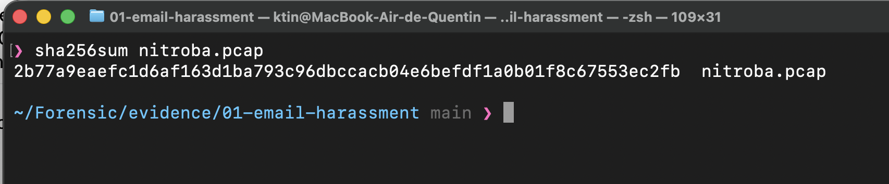
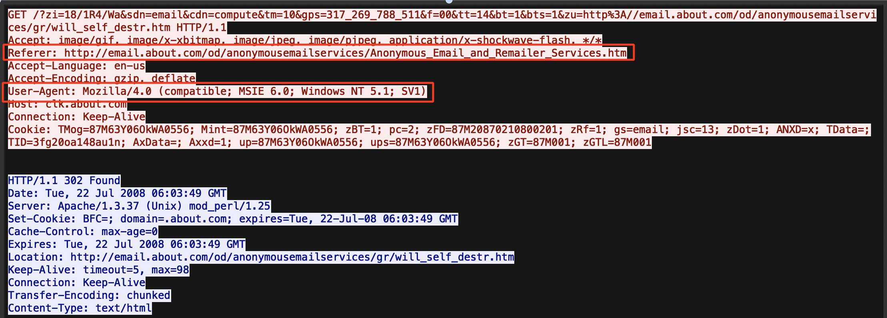
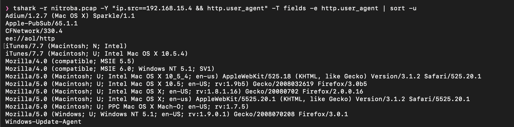
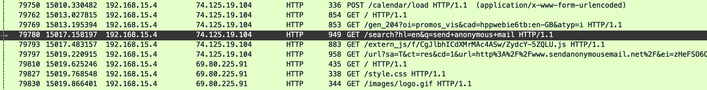
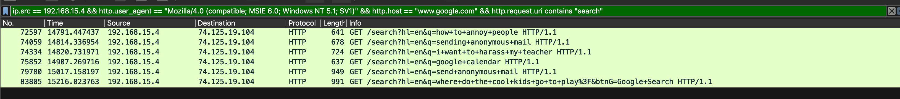

# Case 01: Email Harassment Investigation

## Executive Summary

## Executive Summary

Une enseignante de l'université Nitroba a reçu plusieurs emails de harcèlement en juillet 2008, envoyés via des services d'emails anonymes en ligne. L'analyse du trafic réseau capturé sur le point d'accès Wi-Fi non protégé d'un dortoir a permis d'isoler le navigateur à l'origine des envois, malgré une adresse IP partagée par plusieurs utilisateurs. En reconstituant l'historique de navigation de ce navigateur, une suite de recherches Google révèle une intention progressive de harceler un professeur, menant à une session Google Calendar/Gmail identifiant le compte `jcoachj@gmail.com`. Ce compte correspond à un étudiant du cours de chimie CHEM109 de la victime, désignant ce dernier comme l'auteur le plus probable des messages.

## Case Background

Enquête sur un email de harcèlement envoyé par un étudiant à un membre du corps enseignant. Le cas est basé sur un scénario hébergé par digitalcorpora.org ([description du scénario](https://digitalcorpora.org/corpora/scenarios/nitroba-university-harassment-scenario/) et [capture réseau](https://downloads.digitalcorpora.org/corpora/scenarios/2008-nitroba/nitroba.pcap) disponibles sur leur site).

## Objective

Utiliser Wireshark et t-shark pour analyser le trafic réseau capturé et identifier les preuves permettant de reconstituer l'origine et le contenu de l'email de harcèlement.

## Known Facts (Given Information)

- L'enseignante (Lily Tuckrige) a reçu un premier email de harcèlement sur son 
  adresse personnelle Yahoo, provenant de l'adresse `nobody@nitroba.org`.
- Après signalement au support IT, elle a fourni les en-têtes complets du mail. 
  L'en-tête `Received` indique une connexion SMTP depuis l'IP `140.247.62.34`.
- Une résolution DNS inverse de cette IP pointe vers `G24.student.nitroba.org`, 
  une chambre du dortoir universitaire.
- La chambre G24 est partagée par trois étudiantes : Alice, Barbara et Candice.
- Le réseau des dortoirs fournit un port Ethernet filaire dans chaque chambre, 
  mais pas de Wi-Fi officiel.
- Le petit ami de l'une des occupantes (Kenny, petit ami de Barbara) a installé 
  un point d'accès Wi-Fi personnel dans la chambre, **sans mot de passe**.
- Conséquence importante pour l'investigation : n'importe quel appareil à portée 
  du signal Wi-Fi peut se connecter sans authentification et utiliser l'IP de la 
  chambre pour sortir sur le réseau. L'IP source ne suffit donc pas à elle seule 
  à identifier l'auteur : il faudra chercher d'autres éléments dans le trafic 
  capturé (user-agent, cookies de session, contenu des requêtes) pour relier une 
  connexion précise à une personne.
- Un **second email** est reçu peu après, cette fois envoyé via 
  `noreply@willselfdestruct.com`, un service tiers d'emails anonymes et 
  temporaires (message affiché une seule fois puis détruit). Le contenu confirme 
  qu'il s'agit du même harceleur : *"vous ne pouvez pas vous cacher de nous, 
  arrêtez d'enseigner"* (paraphrase).
- Ce service nécessite que l'auteur ait lui-même visité `willselfdestruct.com` 
  pour composer et envoyer le message. C'est une piste distincte de l'envoi SMTP 
  initial : si une visite de ce site est retrouvée dans la capture réseau, 
  provenant de la même IP ou dans une fenêtre de temps cohérente, cela renforce 
  la corrélation entre les deux emails et la ou les connexions suspectes.
- La liste des étudiants du cours de chimie CHEM109 de Lily Tuckrige est 
  disponible comme liste de suspects potentiels (nécessaire uniquement si 
  l'auteur s'avère être un étudiant du cours, à confirmer par l'analyse).

## Investigation Plan

1. Cartographier le réseau de la chambre concernée à partir de la capture réseau.
2. Retrouver le flux TCP correspondant à l'envoi du premier mail de harcèlement.
3. Rechercher dans la capture une connexion vers `willselfdestruct.com` 
   correspondant à l'envoi du second mail, et vérifier si elle provient de la 
   même source que le premier envoi.
4. Identifier les autres connexions réseau associées à cette même source dans 
   la capture (navigation web, autres services).
5. Rechercher, dans ces connexions, une information permettant d'identifier 
   concrètement l'auteur (au-delà de la simple adresse IP partagée) : par 
   exemple des identifiants saisis dans un formulaire, un cookie de session, 
   ou tout élément liant une session réseau à une personne précise.
## Tools & Environment

- Wireshark
- t-shark (CLI)

## Methodology

### 0. Download and Integrity Verification

Avant de commencer l'analyse, il faut vérifier l'intégrité du fichier de preuve 
téléchargé en comparant son empreinte avec le hash officiel publié sur 
digitalcorpora.org. Cette étape garantit que le pcap n'a pas été altéré ou 
corrompu pendant le transfert, une première étape standard pour maintenir la 
chaîne de possession (chain of custody) d'une preuve numérique.

<p align="center">
  
</p>


**SHA256 attendu :** `2b77a9eaefc1d6af163d1ba793c96dbccacb04e6befdf1a0b01f8c67553ec2fb`


### 1. Initial Traffic Analysis (Wireshark)

Recherche de connexions SMTP en filtrant le trafic sur le port 25, mais aucun résultat (logique, car le sniffer a été lancé après l'envoi du premier mail, et le second a été envoyé depuis une plateforme en ligne plutôt que par SMTP classique).

J'ai donc filtré les requêtes HTTP vers le domaine `willselfdestruct.com`, et une IP est ressortie : `192.168.15.4`. En suivant le flux TCP de la requête, on peut voir l'interface du site. Les en-têtes de la requête donnent déjà quelques informations sur le coupable, notamment son User-Agent (navigateur + OS) : Mozilla + Windows XP. Le champ Referer montre que le coupable est arrivé sur ce site via une navigation active, depuis une autre URL.

<p align="center">
  
</p>

La requête POST associée à ce même flux contient le contenu exact du message harceleur en clair :

```
to=lilytuckrige@yahoo.com&from=&subject=you+can%27t+find+us&message=and+you+can%27t+hide+from+us...Stop+teaching...Start+running.
```

Ce paquet correspond au frame 83601, à t=15197.2s dans la capture.

### 2. Identifying Other Users on the Network via User-Agent

Puisque le point d'accès Wi-Fi est ouvert (sans mot de passe), plusieurs appareils différents peuvent partager la même adresse IP source (`192.168.15.4`) une fois passés par le NAT du routeur. Avant de me concentrer uniquement sur le suspect, j'ai utilisé tshark pour lister l'ensemble des User-Agents ayant émis du trafic depuis cette IP, afin d'avoir une idée du nombre d'appareils réellement présents sur le réseau au moment de la capture.

```bash
tshark -r nitroba.pcap -Y "ip.src==192.168.15.4 && http.user_agent" -T fields -e http.user_agent | sort -u
```

<p align="center">
  
</p>

Cette commande retourne une quinzaine de User-Agents distincts. Sans pouvoir encore associer chacun à une personne précise, on peut déjà déduire le type d'appareil ou d'application derrière chaque signature :

| User-Agent | Appareil / logiciel probable |
|---|---|
| `Adium/1.2.7 (Mac OS X) Sparkle/1.1` | Client de messagerie instantanée multi-protocoles sur Mac |
| `Apple-PubSub/65.1.1` | Composant système Mac OS X (abonnements RSS/podcasts) |
| `CFNetwork/330.4` | Bibliothèque réseau système Mac OS X (trafic d'arrière-plan, pas un navigateur) |
| `ee://aol/http` | Client ou toolbar AOL (probablement AOL Instant Messenger) |
| `iTunes/7.7 (Macintosh; N; Intel)` | iTunes sur Mac Intel |
| `iTunes/7.7 (Macintosh; U; Intel Mac OS X 10.5.4)` | iTunes sur un autre Mac Intel (OS X 10.5.4) |
| `Mozilla/4.0 (compatible; MSIE 5.5)` | Internet Explorer 5.5, machine Windows ancienne |
| `Mozilla/4.0 (compatible; MSIE 6.0; Windows NT 5.1; SV1)` | Internet Explorer 6 sous Windows XP — **le User-Agent associé à l'envoi du message harceleur** |
| `Mozilla/5.0 (Macintosh...) Safari/525.20.1` | Safari sur Mac OS X 10.5.4 |
| `Mozilla/5.0 (Macintosh...) rv:1.9b5 ... Firefox/3.0b5` | Firefox 3.0 bêta sur Mac OS X 10.5 |
| `Mozilla/5.0 (Macintosh...) rv:1.8.1.16 ... Firefox/2.0.0.16` | Firefox 2 sur Mac OS X |
| `Mozilla/5.0 (Macintosh...) Safari/5525.20.1` | Safari (version différente) sur Mac OS X |
| `Mozilla/5.0 (Macintosh; U; PPC Mac OS X Mach-O...) rv:1.7.5` | Navigateur Mozilla sur un Mac PowerPC, plus ancien |
| `Mozilla/5.0 (Windows; U; Windows NT 5.1...) Firefox/3.0.1` | Firefox 3.0.1 sous Windows XP — machine Windows distincte de celle du harceleur |
| `Windows-Update-Agent` | Trafic système Windows Update, pas une action utilisateur |

Cette diversité (plusieurs Mac de générations différentes, au moins deux machines Windows distinctes, plusieurs navigateurs) confirme que le réseau était bien utilisé simultanément par plusieurs personnes au moment de la capture, cohérent avec le contexte d'un Wi-Fi ouvert dans une chambre partagée. Aucun nom n'est encore associé à ces appareils à ce stade ; cette étape sert uniquement à cartographier le nombre d'utilisateurs distincts avant de chercher, dans les étapes suivantes, des informations permettant de les identifier individuellement.

Pour aller plus loin, plutôt que de deviner service par service, j'ai filtré directement toutes les requêtes **POST** émises depuis `192.168.15.4` (les POST contiennent presque toujours des données de connexion), et associé chaque User-Agent aux services qu'il contacte. J'ai ensuite écarté les User-Agents purement système (`Windows-Update-Agent`, `Apple-PubSub`, `CFNetwork`, `ee://aol/http`) qui ne représentent pas une navigation active, pour ne garder que les navigateurs réellement utilisés par une personne.

```bash
tshark -r nitroba.pcap -Y "ip.src==192.168.15.4 && http.request.method==\"POST\"" -T fields -e http.user_agent -e http.host -e http.request.uri | sort -u
```

| User-Agent | Services / comptes contactés | Interprétation |
|---|---|---|
| `MSIE 6.0; Windows NT 5.1` | `mail.google.com` et `google.com/calendar` avec `gausr=jcoachj@gmail.com`, `login.live.com`, `willselfdestruct.com/secure/submit`, `sendanonymousemail.net/send.php` | Navigateur du suspect. Connecté sur Gmail/Google Calendar en tant que `jcoachj@gmail.com`, a utilisé **deux services d'emails anonymes différents** |
| `MSIE 5.5` | `filetransfer.msg.yahoo.com/notifyft` | Machine Windows distincte, utilisateur de Yahoo Messenger (notification de transfert de fichier), aucun identifiant explicite trouvé |
| `Firefox/2.0.0.16` (Mac) | `facebook.com/login.php`, `/add.php`, `/ajax/reqs.php`, `apps.facebook.com/adoptman`, `orbitz.com`, `ichotelsgroup.com` | Tentative de connexion Facebook détectée, mais aucun identifiant/nom en clair dans les champs extraits ; navigue aussi sur des sites de réservation de voyage |
| `Safari/5525.20.1` (build non standard) | `search.namequery.com` | Ne correspond pas à un vrai Safari : cette signature correspond à l'agent anti-vol Absolute/Computrace repéré précédemment, mais aucun identifiant n'a été extrait avec ce filtre (nécessiterait un Follow TCP Stream complet) |
| `Firefox/3.0b5` (Mac) | `ocsp.thawte.com` | Simple vérification de certificat SSL en arrière-plan, pas une navigation active |

Un second filtre sur les requêtes **GET** contenant des mots-clés de connexion (`login`, `auth`, `user`, `@`) confirme et enrichit ces pistes, notamment un nouveau User-Agent :

```bash
tshark -r nitroba.pcap -Y "ip.src==192.168.15.4 && http.request.method==\"GET\" && (http.request.uri contains \"login\" || http.request.uri contains \"auth\" || http.request.uri contains \"user\" || http.request.uri contains \"@\")" -T fields -e http.user_agent -e http.host -e http.request.uri | sort -u
```

| User-Agent | Services / comptes contactés | Interprétation |
|---|---|---|
| `Safari/525.20.1` (Mac OS X 10.5.4, build standard) | Avatars Yahoo (`img.avatars.yahoo.com`), `linkarena.com/login` | Un **autre Mac**, distinct de celui portant l'agent Absolute (build Safari différent) ; aucun identifiant explicite trouvé, seulement une tentative de connexion sur linkarena.com |

Ces deux passes confirment la présence d'au moins **5 User-Agents distincts** sur le réseau, et surtout, elles isolent clairement le User-Agent du suspect (`MSIE 6.0; Windows NT 5.1`) comme étant le seul, parmi tous ceux observés, à avoir contacté à la fois Gmail sous l'identité `jcoachj@gmail.com` **et** deux services d'envoi d'emails anonymes distincts.


#### 3. Retrace Web Navigation

En recherchant la navigation web de cette session, on trouve une recherche Google : *"send anonymous email"*.

<p align="center">
  
</p>

Après cette découverte, l'étape suivante consiste à retrouver **toutes** les recherches Google effectuées par ce même User-Agent sur toute la durée de la capture, afin de reconstituer l'intention et la chronologie complète du suspect. Pour cela, on filtre spécifiquement les requêtes vers `google.com` contenant `/search`, qui correspond au format des URLs de recherche Google :

<p align="center">
  
</p>

On peut voir ici l'ensemble des recherches effectuées par ce User-Agent sur la durée de la capture, notamment :

| Temps relatif | Recherche |
|---|---|
| t = 14791.4s | *"how to annoy people"* |
| t = 14814.3s | *"sending anonymous mail"* |
| t = 14820.7s | *"i want to harass my teacher"* |
| t = 14907.3s | *"google calendar"* |
| t = 15017.2s | *"send anonymous mail"* |
| t = 15216.0s | *"where do the cool kids go to play?"* |

Cette suite de recherches dessine une intention claire et progressive : d'abord chercher comment embêter quelqu'un, puis spécifiquement comment harceler son professeur, puis comment envoyer un email anonyme pour le faire, avant de se connecter à Google Calendar (ce qui mènera à l'identification du compte Gmail associé).

## Findings

Le User-Agent `MSIE 6.0; Windows NT 5.1` se distingue de tous les autres observés sur le réseau par une navigation cohérente et intentionnelle : recherches successives sur comment harceler un professeur et envoyer un email anonyme, suivies d'une connexion à Google Calendar puis à Gmail. Cette session Google Calendar révèle l'adresse `jcoachj@gmail.com`, un identifiant qui correspond à un élève du cours de chimie de la victime (Johnny Coach, présent dans la liste de classe CHEM109). Ce même User-Agent est également celui à l'origine de l'envoi du message harceleur vers willselfdestruct.com. En croisant la navigation, l'identifiant de compte et l'envoi du message, on obtient notre coupable.

## Conclusion

L'ensemble des éléments recueillis converge vers une seule et même personne : le titulaire du compte `jcoachj@gmail.com`, vraisemblablement Johnny Coach, étudiant du cours de chimie CHEM109 de Lily Tuckrige. La navigation Google révèle une intention progressive et délibérée de harceler son enseignante, la session Gmail/Calendar associée à ce même navigateur permet de l'identifier nommément, et ce même poste est celui ayant effectivement envoyé le message harceleur. Cette conclusion reste une déduction circonstancielle basée sur la corrélation de session et de comportement, et non une preuve d'identité absolue ; elle mériterait, dans un cadre réel, d'être corroborée par d'autres moyens d'investigation.

## Skills Demonstrated

- Analyse de trafic réseau avec Wireshark et t-shark (CLI)
- Filtrage et corrélation de protocoles (HTTP, SMTP)
- Vérification de l'intégrité d'une preuve numérique (hashing, chaîne de possession)
- Compréhension d'une architecture réseau avec NAT et de son impact sur l'attribution par IP
- Reconstitution d'une chronologie de navigation web à partir de captures réseau
- Corrélation multi-sources (IP, User-Agent, requêtes de recherche, sessions applicatives)
- Extraction d'identifiants de compte à partir de requêtes HTTP en clair