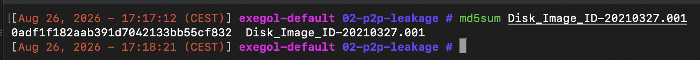
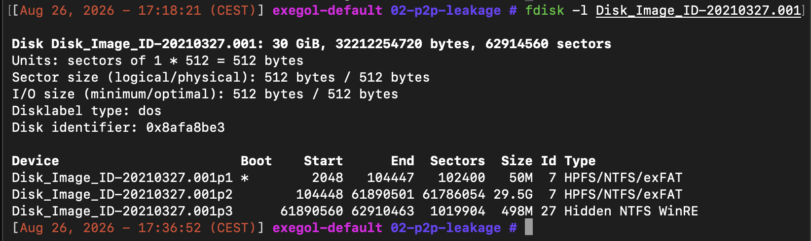
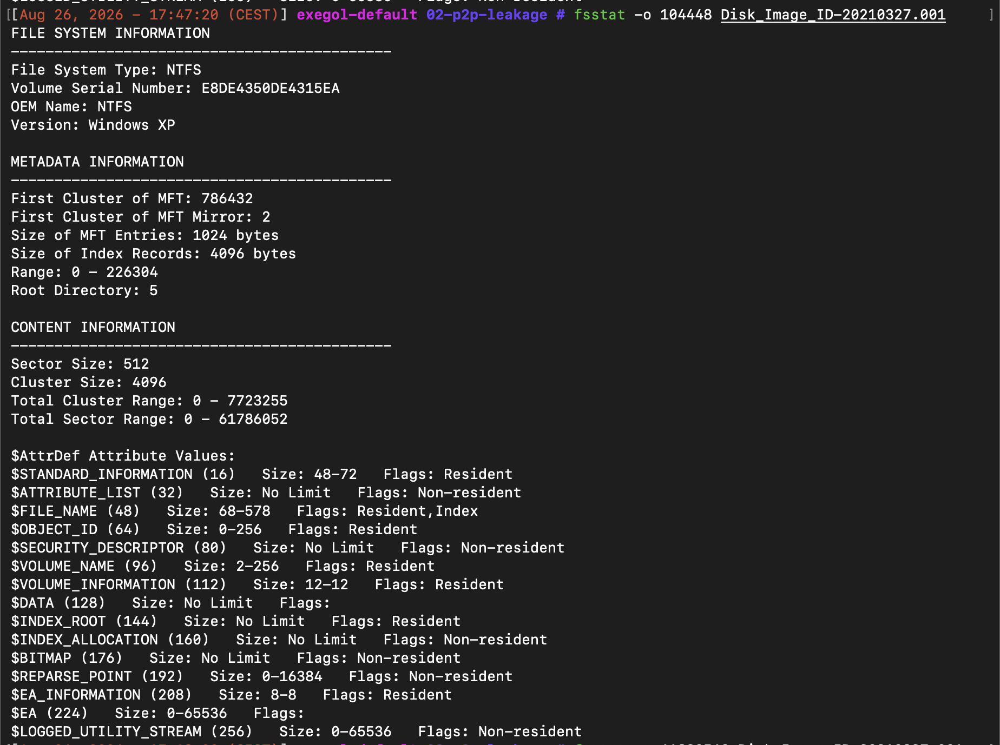
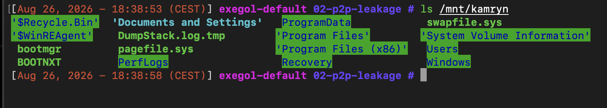
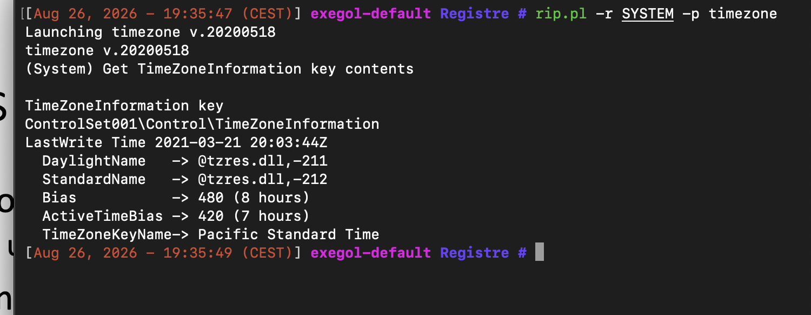
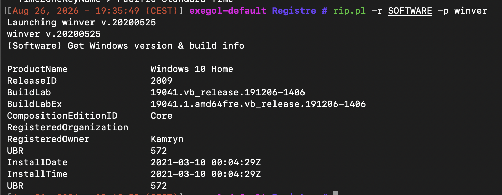
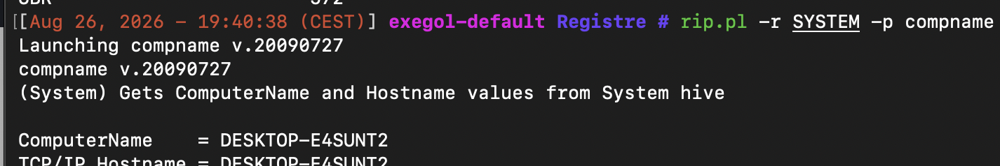
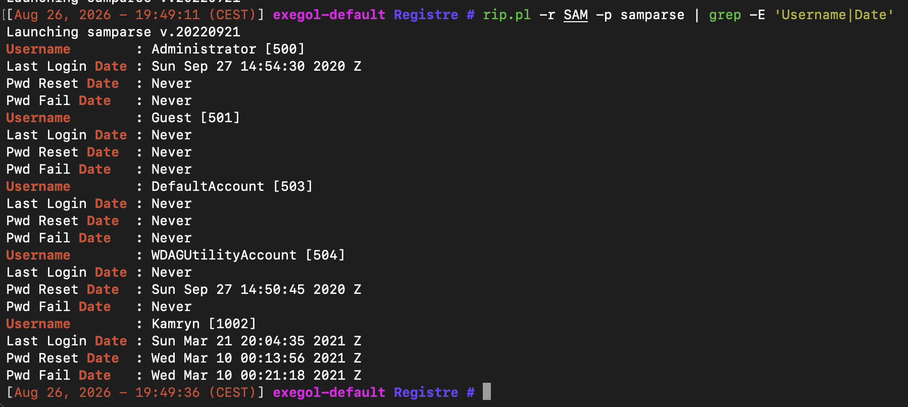
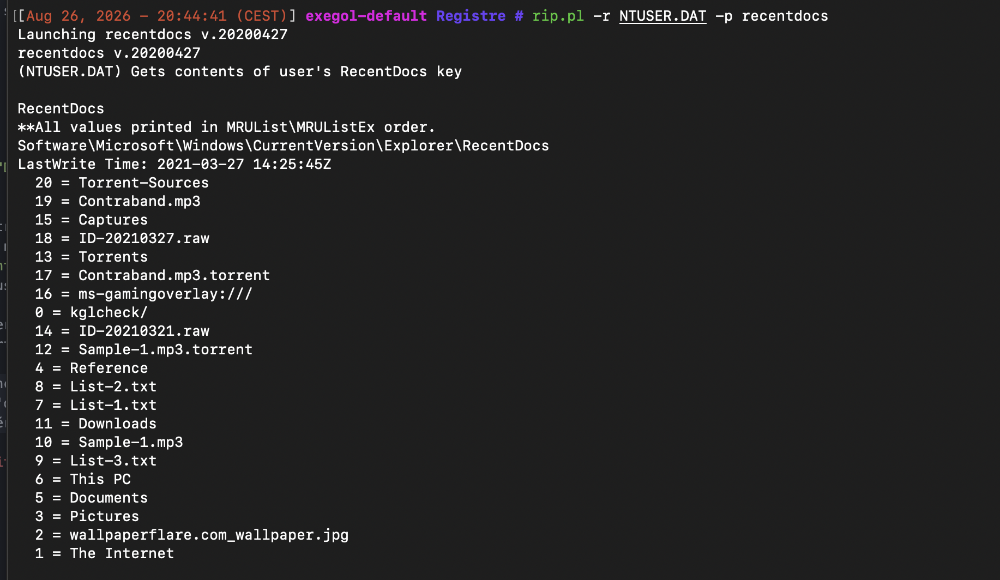
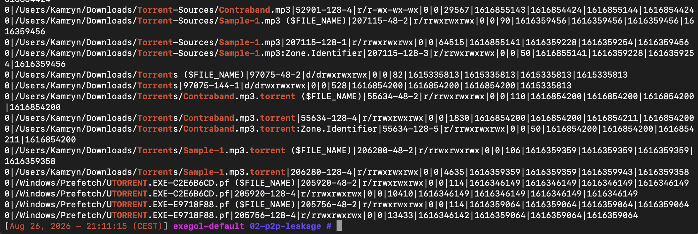

# Case 02: P2P Data Leakage Investigation


## Executive Summary

A compléter a la fin

## Case Background

Beat Step est une entreprise spécialisée dans la production d'effets sonores pour des films et séries télévisées. Deux fichiers audio appartenant à l'entreprise ont été retrouvés distribués sur Internet :
 
- `Contraband.mp3` : fichier protégé par le droit d'auteur, destiné à être utilisé dans un film à venir, *"Fate With Money"*. Ce fichier porte une signature binaire distinctive.
- `Sample-1.mp3` : fichier non soumis au droit d'auteur mais confidentiel, destiné à être présenté en interne lors d'une réunion. Il ne porte pas la signature binaire du premier fichier.
Beat Step a mandaté une équipe d'investigation cyber pour déterminer qui est responsable de la fuite et comment elle a eu lieu. Deux employés sont suspectés : **Kamryn Allen** et **Willis Gibbs**. L'image disque du poste de travail de Kamryn Allen a été saisie et fournie pour analyse.
 
Le cas est basé sur le lab *"P2P Data Leakage"* du dépôt [digital-forensics-lab](https://github.com/frankwxu/digital-forensics-lab) de Frank Xu (University of Baltimore), conçu par Malcolm Hayward comme une version pédagogique plus guidée du cas NIST Data Leakage, avec une timeline plus détaillée.
 

## Objective

Déterminer, à partir de l'image disque du poste de Kamryn Allen :
 
1. Si Kamryn a téléchargé les fichiers .mp3 en question.
2. Si le fichier protégé par le droit d'auteur est bien celui de l'entreprise (prouver ou infirmer son origine).
3. Comment le fichier a été obtenu, le cas échéant.
4. S'il existe des cas où Kamryn a téléchargé/partagé le(s) fichier(s) avec un tiers.
5. S'il existe d'autres suspects potentiellement en possession du/des fichier(s).

## Known Facts (Given Information)

- L'entreprise victime, **Beat Step**, produit des effets sonores pour l'industrie du cinéma/TV.
- Deux fichiers ont fuité : `Contraband.mp3` (protégé par le droit d'auteur, porte une **signature binaire** identifiable, destiné au film *"Fate With Money"*) et `Sample-1.mp3` (non protégé mais **confidentiel**, sans signature binaire).
- Les **hashs MD5 et SHA1** de référence des deux fichiers .mp3 originaux ont été fournis par Beat Step, permettant de vérifier si des copies retrouvées sur le poste correspondent aux fichiers authentiques de l'entreprise.
- Deux suspects sont identifiés en amont : **Kamryn Allen** et **Willis Gibbs**.
- Seule l'image disque du poste de **Kamryn Allen** (Windows 10) a été saisie et mise à disposition pour cette phase de l'investigation ; le poste de Willis Gibbs n'est pas fourni.
- Le hash de référence de l'image disque elle-même est fourni séparément, pour vérification d'intégrité avant analyse (chaîne de possession).


## Investigation Plan

À ce stade, nous ne disposons que l'image disque du poste de Kamryn Allen et les faits donnés en introduction. La démarche d'investigation va partir des éléments les plus généraux vers les plus spécifiques :
 
1. **Valider l'intégrité de l'image** — vérifier le hash avant toute manipulation, pour garantir que l'analyse porte bien sur une copie fidèle de la preuve originale.
2. **Comprendre le système** — identifier l'OS, les partitions, les comptes utilisateurs présents sur la machine, pour savoir à qui et à quoi on a affaire.
3. **Situer l'activité dans le temps** — déterminer les repères temporels disponibles (dernier logon, dernière extinction) afin de cadrer une fenêtre d'investigation cohérente.
4. **Cartographier les fichiers présents** — obtenir une vue d'ensemble du système de fichiers pour repérer ce qui pourrait être pertinent, sans a priori sur la nature des applications ou fichiers en cause.
5. **Construire une timeline système** — reconstituer une chronologie d'activité globale, qui servira de base pour situer chronologiquement tout indice découvert par la suite.
6. **Rechercher des traces d'acquisition ou d'échange de fichiers** — à partir de ce que révèlent les fichiers et applications identifiés, déterminer comment les fichiers en cause auraient pu être obtenus ou transmis.
7. **Vérifier l'authenticité des fichiers suspects** — comparer tout fichier audio retrouvé sur le poste aux fichiers de référence fournis par l'entreprise (hash), pour confirmer ou infirmer qu'il s'agit bien des fichiers volés.
8. **Explorer les autres sources d'activité utilisateur** — emails et historique de navigation, pour voir si elles confirment, nuancent ou contredisent le scénario construit à ce stade.
9. **Corroborer par une source externe si une piste y mène** — vérifier indépendamment tout élément qui pointerait vers l'extérieur du poste (site web, service tiers), pour asseoir la conclusion sur autre chose que la seule machine du suspect.


## Tools & Environment


| Outil | Usage |
|---|---|
| | |

---

## Methodology


### 0. Setup & Intégrité de l'image

La première étape avant de commencer l'analyse de l'image est de vérifier son intégrité au moyen de son hash, qui nous a été fourni par Beat Step. Cette vérification garantit que l'image sur laquelle on travaille est une copie fidèle et non altérée de la preuve originale.

<p align="center">
  
</p>

**Hash attendu :** `0ADF1F182AAB391D7042133BB55CF832`

Le hash MD5 calculé correspond à la valeur attendue, confirmant que l'image analysée est bien celle fournie par Beat Step pour ce cas.

### 1. Image disque, partitions & système

La table de partitions de l'image disque est obtenue avec `fdisk -l` :

```bash
fdisk -l Disk_Image_ID-20210327.001
```

<p align="center">
  
</p>

L'image disque fait 30 GiB au total (32 212 254 720 octets, 62 914 560 secteurs de 512 octets), avec un type de disque `dos` (MBR) et 3 partitions détectées.

- **p1** (50M, flag boot actif) : la petite taille et le flag de démarrage suggèrent une partition système/EFI standard sur un disque Windows.
- **p2** (29.5G) : de loin la plus volumineuse, c'est vraisemblablement le volume principal contenant l'OS et les données utilisateur.
- **p3** (498M, "Hidden NTFS WinRE") : partition de récupération Windows standard, généralement sans intérêt pour l'investigation.

Les trois partitions sont en NTFS, cohérent avec un système Windows.

L'étape suivante consiste à interroger chaque offset avec `fsstat` pour confirmer le système de fichiers exact et récupérer les métadonnées de chaque partition.

```bash
fsstat -o 2048 Disk_Image_ID-20210327.001
fsstat -o 104448 Disk_Image_ID-20210327.001
fsstat -o 61890560 Disk_Image_ID-20210327.001
```

<p align="center">
  
</p>


- **p1 (offset 2048)** : NTFS, nom de volume "System Reserved". Confirme la lecture faite depuis `fdisk` : il s'agit bien de la partition de démarrage.
- **p2 (offset 104448)** : NTFS, aucun nom de volume, mais de loin la plus grande plage de clusters des trois (0 à 7 723 255). Cohérent avec le rôle de volume système/utilisateur principal supposé précédemment.
- **p3 (offset 61890560)** : NTFS, aucun nom de volume. Cohérent avec le type "Hidden NTFS WinRE" vu dans `fdisk`.

Le champ "Version" retourné par `fsstat` affiche "Windows XP" pour les trois partitions, il s'agit d'une limitation connue de l'outil (heuristique NTFS datée) plutôt que d'une donnée fiable.

Cette étape confirme donc que les trois partitions sont bien en NTFS, et renforce l'hypothèse que **p2** est le volume contenant les données utilisateur de Kamryn.


### 2. Registre Windows & comptes utilisateurs

Nous allons maintenant monter la partition 2 sur notre système en lecture seule afin de pouvoir l'analyser sans risquer de l'altérer.

```bash
mkdir -p /mnt/kamryn
mount -o ro,loop,offset=$((104448*512)) Disk_Image_ID-20210327.001 /mnt/kamryn
```

<p align="center">
  
</p>

Une fois la partition montée, nous copions les ruches de registre pertinentes ainsi que le profil utilisateur de Kamryn, afin de pouvoir les analyser sans risquer d'altérer le montage en lecture seule.

```bash
mkdir -p Exports/Registre/
cp /mnt/kamryn/Windows/System32/config/SYSTEM Exports/Registre/
cp /mnt/kamryn/Windows/System32/config/SOFTWARE Exports/Registre/
cp /mnt/kamryn/Windows/System32/config/SAM Exports/Registre/
cp /mnt/kamryn/Users/Kamryn/NTUSER.DAT Exports/Registre/
```

Ces quatre ruches couvrent les informations système essentielles à établir avant d'aller plus loin. SYSTEM contient le fuseau horaire configuré sur la machine, une donnée nécessaire pour interpréter correctement tous les horodatages rencontrés par la suite. SOFTWARE contient la version de Windows installée. SAM contient les comptes utilisateurs locaux ainsi que leurs dates de dernier logon. NTUSER.DAT contient les préférences et l'activité récente propres au profil de Kamryn.

Le plugin `timezone` de RegRipper, exécuté sur la ruche SYSTEM, permet d'obtenir le fuseau horaire configuré sur la machine au moment de l'acquisition de l'image.

```bash
rip.pl -r SYSTEM -p timezone
```

<p align="center">
  
</p>

Le système est configuré sur Pacific Standard Time, avec un décalage de 8 heures par rapport à UTC hors heure d'été (Bias 480 minutes), et de 7 heures pendant l'heure d'été (ActiveTimeBias 420 minutes). Ce fuseau correspond à la côte ouest des États-Unis.

Cette information est déterminante pour la suite de l'analyse, puisque les horodatages rencontrés dans les prochains artefacts pourront être exprimés selon ce fuseau local plutôt qu'en UTC. Il faudra donc systématiquement vérifier le référentiel temporel utilisé par chaque outil avant de comparer des dates entre elles, afin de construire une timeline cohérente.

Le plugin `winver` de RegRipper, exécuté sur la ruche SOFTWARE, permet d'obtenir la version exacte du système d'exploitation installé.

```bash
rip.pl -r SOFTWARE -p winver
```

<p align="center">
  
</p>

Le système tourne sous Windows 10 Home (build 19041, ReleaseID 2009), installé le 10 mars 2021. Le champ RegisteredOwner confirme que le poste est bien enregistré au nom de Kamryn.

Cette étape confirme la version réelle du système d'exploitation, qui n'était pas déterminable lors de l'analyse des partitions puisque l'outil utilisé à ce moment-là affichait une valeur générique et peu fiable pour ce champ.

Le plugin `compname` de RegRipper, exécuté sur la ruche SYSTEM, permet d'obtenir le nom de la machine.

```bash
rip.pl -r SYSTEM -p compname
```

<p align="center">
  
</p>

Le nom d'hôte du système est DESKTOP-E4SUNT2.

Le plugin `samparse`, exécuté sur la ruche SAM, permet de lister les comptes utilisateurs locaux ainsi que leurs dates de connexion et de modification de mot de passe.

```bash
rip.pl -r SAM -p samparse
```

<p align="center">
  
</p>

Cinq comptes locaux sont présents sur le système. Les comptes intégrés Windows (Administrator, Guest, DefaultAccount, WDAGUtilityAccount) n'ont jamais été utilisés, à l'exception d'Administrator dont la dernière connexion date du 27 septembre 2020, probablement lors de l'installation initiale du système. Le seul compte utilisateur réel du poste est celui de Kamryn, créé le 10 mars 2021, avec une dernière connexion enregistrée le 21 mars 2021 à 20h04 UTC.

Cette date de dernière connexion constitue un repère temporel important pour situer la fenêtre d'activité pertinente sur ce poste.

Le plugin `recentdocs` de RegRipper, exécuté sur la ruche NTUSER.DAT du profil de Kamryn, permet de lister les fichiers et dossiers récemment ouverts via l'explorateur Windows.

```bash
rip.pl -r NTUSER.DAT -p recentdocs
```

<p align="center">
  
</p>

Cette clé révèle une activité récente concentrée entre le 21 et le 27 mars 2021. Deux entrées retiennent particulièrement l'attention : `Contraband.mp3` et `Sample-1.mp3`, dont les noms correspondent exactement aux deux fichiers signalés comme volés par Beat Step. On retrouve également leurs équivalents `.torrent` (`Contraband.mp3.torrent` et `Sample-1.mp3.torrent`), ainsi que des dossiers nommés Torrents, Torrent-Sources et Captures, et plusieurs fichiers `.raw` et `.txt`.

La sous-clé `.mp3` montre que ces deux fichiers ont été ouverts pour la dernière fois le 27 mars 2021 à 14h25 UTC, tandis que la sous-clé `.torrent` situe leur dernière ouverture un peu plus tôt le même jour, à 14h10 UTC.

Cette première observation confirme la présence des deux fichiers recherchés sur le poste de Kamryn, mais reste à ce stade une preuve d'ouverture récente, pas encore une preuve d'origine ou de mode d'acquisition. Ce point sera creusé dans les sections suivantes, consacrées à l'application torrent et à la vérification d'authenticité des fichiers audio.


### 3. Arborescence de fichiers & indices initiaux

Le fichier de listing généré avec `fls` permet de localiser précisément sur le disque les éléments repérés jusqu'ici dans le registre.

```bash
fls -o 104448 -r -m / Disk_Image_ID-20210327.001 > Export/fls/file_listing.csv
grep -i "contraband\|sample-1\|torrent" Export/fls/file_listing.csv
```

<p align="center">
  
</p>

Ce listing confirme la présence d'une application torrent installée sur le poste, avec un dossier `AppData\Roaming\uTorrent` contenant l'exécutable `uTorrent.exe`, ses fichiers de configuration (`settings.dat`, `resume.dat`, `dht.dat`), ainsi que plusieurs versions antérieures marquées comme supprimées. Un raccourci vers cette application est également présent sur le bureau du profil Kamryn.

Deux fichiers `.torrent` correspondant exactement aux fichiers signalés par Beat Step sont retrouvés à plusieurs endroits du disque, notamment dans `AppData\Roaming\uTorrent` et dans `Downloads\Torrents`. Les fichiers `Contraband.mp3` et `Sample-1.mp3` eux-mêmes apparaissent également en plusieurs exemplaires, dans `Downloads`, `Downloads\Torrent-Sources`, et `Documents\Reference\Work`.

Des entrées de préchargement Windows (Prefetch) pour `UTORRENT.EXE` sont également présentes, ce qui constitue une preuve d'exécution effective de l'application sur le poste, à deux reprises distinctes.

Ces éléments, combinés à ceux relevés dans le registre, établissent la présence sur le disque d'une application torrent, des fichiers `.torrent` correspondant aux deux fichiers recherchés, et de multiples copies des fichiers audio eux-mêmes. Le lien précis entre ces éléments, savoir si l'un a servi à obtenir l'autre, sera établi dans les sections suivantes consacrées à l'analyse de l'application torrent et à la vérification d'authenticité des fichiers.


### 4. Timeline MFT


### 5. Application P2P & fichiers torrent


### 6. Log de l'application torrent


### 7. Vérification de fichiers (signatures)


### 8. Emails


### 9. Historique de navigation web


### 10. Corroboration externe (site web)


## Timeline

## Findings


## Conclusion


## Skills Demonstrated

